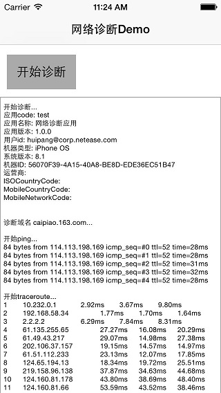

# LDNetDiagnoService_IOS
===============

>利用ping和traceroute的原理，对指定域名（通常为后台API的提供域名）进行网络诊断，并收集诊断日志。功能通过Service的方式提供给各个产品项目，由各个项目组决定如何使用。

## LDNetDiagnoService最终效果
-------------------
>
* 调用网络诊断服务，监控日志输出；
* 诊断结束之后，返回日志文本;
* 调用者可以选择保存、邮件上传、接口上传等方式上传监控日志；

>如下图所示：

## 如何集成LDNetDiagnoService_IOS
-------------------

### Pod集成

>
强烈推荐采用Pod集成。具体方法如下：

1.  Clone线上repo仓库到本地 (第一次创建私有类库引用)

		pod repo add podspec https://git.ms.netease.com/commonlibraryios/podspec.git 
		pod repo update podspec
	
2. 在项目工程的Podfile文件中加载LDNetDiagnoService库：

		pod 'LDNetDiagnoService'

### 代码拷贝集成

>
如果没有私有库Pod访问权限（可以联系技术支持），也可以拷贝工程中[LDNetDiagnoService文件夹](LDNetDiagnoService) 到你所在项目的工程文件夹中 进行代码集成；

## 如何使用LDNetDiagnoService_IOS
---------------------------------

> 通过pod或者代码拷贝service代码到工程之后，即可通过如下方式调用网络诊断服务：

1. 初始化service，并为service设置监控日志输出的delegate；
tip：初始化参数只需要初始化appcode，userID, dormain（必须）, 其他参数如果不设置，service会自动补上这些日志参数；
		
    	_netDiagnoService = [[LDNetDiagnoService alloc] initWithAppCode:@"test" appName:@"网络诊断应用" appVersion:@"1.0.0" userID:@"huipang@corp.netease.com" deviceID:nil dormain:@"caipiao.163.com" carrierName:nil ISOCountryCode:nil MobileCountryCode:nil MobileNetCode:nil];
    	_netDiagnoService.delegate = self;
	

2. service中提供开启或停止网络诊断的功能；

		-(void) startNetDiagnosis {
    		if(!_isRunning){
        		[_indicatorView startAnimating];
        		[btn setTitle:@"停止诊断" forState:UIControlStateNormal];
        		_txtView_log.text = @"";
        		_logInfo = @"";
        		//开启网络诊断
        		[_netDiagnoService startNetDiagnosis];
    		} else {
        		[_indicatorView stopAnimating];
        		[btn setTitle:@"开始诊断" forState:UIControlStateNormal];
        		//停止网络诊断
        		[_netDiagnoService stopNetDialogsis];
    		}
    		_isRunning = !_isRunning;
		}

3. 重载delegate方法，监控网络诊断日志；

	* 监控诊断开始
	
			#pragma mark NetDiagnosisDelegate
			-(void)netDiagnosisDidStarted {
    			NSLog(@"开始诊断～～～");
			}

	* 监控网络诊断过程中的日志输出
	
			-(void)netDiagnosisStepInfo:(NSString *)stepInfo {
    			NSLog(@"%@", stepInfo);
    			_logInfo = [_logInfo stringByAppendingString:stepInfo];
    			dispatch_async(dispatch_get_main_queue(), ^{
        			_txtView_log.text = _logInfo;
    			});
			}

	* 诊断结束，输出全部日志记录

			-(void)netDiagnosisDidEnd:(NSString *)allLogInfo;{
			    //可以保存到文件，也可以通过邮件发送回来
    			dispatch_async(dispatch_get_main_queue(), ^{
        			[_indicatorView stopAnimating];
        			[btn setTitle:@"开始诊断" forState:UIControlStateNormal];
			        _isRunning = NO;
    			});
			}
 

## 如何通过textview监控日志输出
---------------------------------
>
* 如果产品需要通过textview缄口日志输出过程，可以参考demo例子中的ViewController的代码；

>
* 在网络诊断结束的时候，将日志文件上传；

## 技术支持
-------------------

>
to be continued ....

庞辉, 电商技术中心，popo：__huipang@corp.netease.com__
